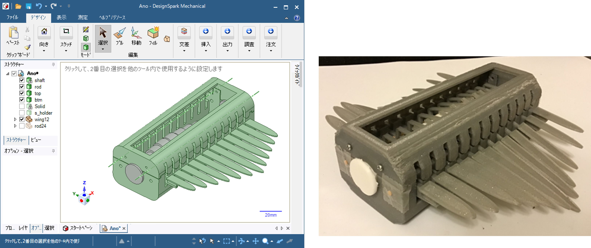
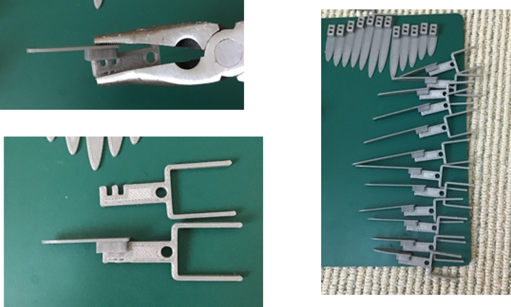
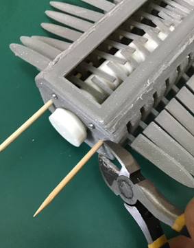
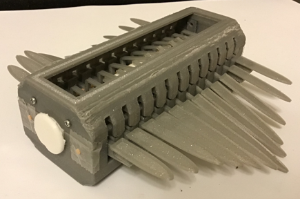
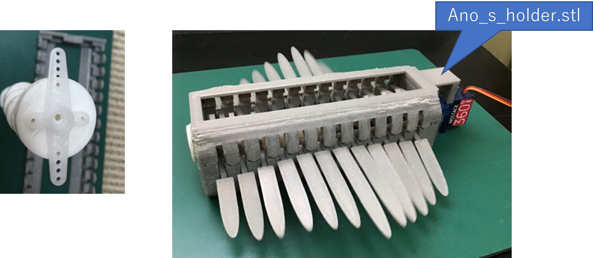
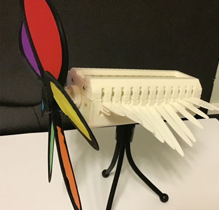

# Anomanocaris Robot

[たなかじゅんさん](https://twitter.com/juntnk)の書籍[「ナッちゃんの図解でわかるものづくりはパズル」](https://www.amazon.co.jp/dp/B07PBX87GJ/ref=cm_sw_em_r_mt_dp_GG2PPCP7PMJ3PVA7AAYX)に出てくるアノマノカリスロボを３Dプリンタで作成可能な機構に落とし込みました。

***
## 部品

３Dプリント外の部品としてφ3ｍｍ程度の丸い棒が必要です。私は竹串を使用しています。

***  

## 組み立て
1.ロッドと羽根の部品をペンチなどではめ込みます。

  

  ***  

2.シャフトをボトムにセットし、写真のように羽をはめ込んでいきます。

  ***  

3.反対側も同じように。

  ***  

4.はみ出た串はニッパーでカット。破片が飛ばないように気を付けて。

  ***  

5.トップをかぶせて完成。

***

## 応用
シャフトにはサーボホーンをビス止め出来る穴をつけています。SG-90を想定したホルダーのデータも作成しましたので、サーボモーターを取付できます。

シャフトにプロペラをつければ風力で動かすこともできます。

